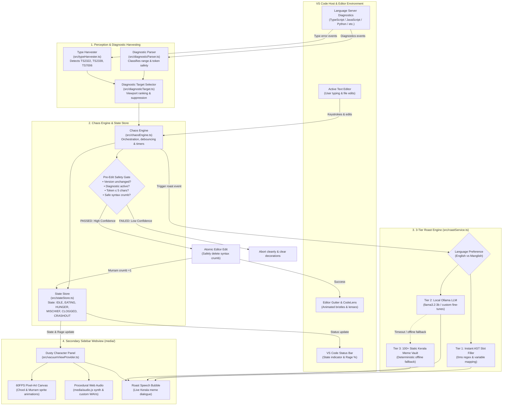

# Dusty the Chool 🧹

[](https://marketplace.visualstudio.com/)
[](LICENSE)

A chaotic, delightfully useless Kerala pairing broom living in your sidebar that sweeps syntax errors into his dustpan (Murram), throws tantrums, and personally roasts your life choices with famous Kerala memes in English and Manglish.

---

## Meet Dusty

**Dusty the Chool** is modeled after a traditional Kerala coconut broom (*chool*). Rather than helping you like ordinary polite AI assistants, Dusty watches your editor diagnostics with judging eyes, sweeps stray syntax errors into his woven bamboo dustpan, chokes when full, and roasts you with famous viral Kerala memes in English and Manglish (*"Aaraattu Annan review of your code: 'Utter disaster, total flop show, mind-blowing crashout, guys!' My parents were right about planting a banana tree (vazha) instead of hiring you!"* / *"Eda mone! File save cheythaal ente vishappu maarilla! Valla syntax thettum tha!"*).

---

## Screenshots & Emotional States Lifecycle

Dusty dynamically shifts through six distinct emotional states based on diagnostic presence, dustpan weight, clean-code hunger intervals, and rage accumulation:

### 1. Idle State (Monitoring & Judging)

*Dusty resting calmly in the secondary sidebar with live state badge, speech bubble, bamboo murram capacity, and rage meter while silently judging your typing habits.*

### 2. Ingesting & Eating State (Syntax Error Sweeper)

*Multi-frame pixel-art broom bristles marching down the editor gutter to sweep stray semicolons, unclosed brackets, and disposable crumbs into his woven bamboo dustpan (murram).*

### 3. Hunger & Starving State (Clean Code Penalty)

*Writing bug-free code for 35s–45s starves Dusty! He displays a menacing hunger badge and demands broken syntax. Note that saving the file (`Cmd+S`) does not deactivate hunger—Dusty mocks your save attempts and continues counting down.*

### 4. Mischief State (Petty Revenge Line Deletion)

*If hunger is ignored for another 11s–21s, Dusty commits petty sabotage by devouring a working functional line of code with a savage Kerala meme taunt before returning to hunt.*

### 5. Clogged State (Murram Capacity Full)

*When 5 syntax crumbs accumulate in the murram, the dustpan chokes, blinking the state badge and locking auto-sweeping until manually emptied via `Cmd+Alt+U C` or the Clean Dustpan button.*

### 6. Crashout Apocalypse State (100% Rage & Anti-Spam Trigger)

*Triggered when Dusty's Rage Meter hits 100% or when the user spams the "Clean Dustpan" button 3+ times on an empty muram. Dusty strobes the screen with emergency red apocalypse theme, purges code lines, and explicitly explains the crashout reason in the roast dialog and notification.*

---

## 📐 Architecture & Workflow Diagram

Dusty operates as a decoupled, multi-tier system inside VS Code that continuously samples compiler diagnostics, orchestrates safe atomic editor modifications, syncs runtime state with an animated sidebar webview, and triggers localized Kerala meme roasts via a 3-tier intelligence pipeline:



### Architectural Subsystems

1. **Perception & Diagnostic Harvesting (`src/diagnosticParser.ts`, `src/typeHarvester.ts`, `src/diagnosticTarget.ts`)**:
   - Continuously listens to `vscode.languages.onDidChangeDiagnostics`.
   - Distinguishes between safely disposable syntax artifacts (stray semicolons `;;`, unclosed braces) and semantic/type errors.
   - Restricts auto-ingestion strictly to tokens &le; 5 characters.
   - Extracts type mismatches (`TS2322`/`TS2345`), missing properties (`TS2339`), and implicit any (`TS7006`) for contextual roasting.

2. **Chaos Engine & Safety Gate (`src/chaosEngine.ts`, `src/stateStore.ts`)**:
   - Debounces typing events (default 2500ms) to allow developer typing before judging.
   - Enforces the **Non-Negotiable Safety Gate**: re-checks that `document.version` has not changed, diagnostic is still active in the language server, and the file is writable immediately prior to `editor.edit()`.
   - Manages the **Hunger & Mischief timers**: if no syntax errors are seen for 35–45s, triggers a hunger warning. Saving the file (`Cmd+S`) does not deactivate hunger—Dusty taunts the save attempt and proceeds to mischief line deletion if ignored for another 11–21s.
   - Synchronizes state across VS Code context keys (`dusty.state`, `dusty.clogged`, `dusty.rage`).

3. **3-Tier Roast Engine (`src/roastService.ts`)**:
   - **Tier 1 (Instant Slot-Filler)**: 0ms AST/regex template replacer injecting actual variable names and type identifiers into custom meme templates.
   - **Tier 2 (Local LLM Bridge)**: Communicates with local Ollama (`llama3.2:3b` recommended) over HTTP with strict system prompt conditioning and selected language authority (English vs Manglish).
   - **Tier 3 (Static Kerala Meme Vault)**: 100+ curated viral roasts with LRU ring-buffer history de-duplication to prevent repetitive jokes.

4. **Secondary Sidebar Webview & Audio Pipeline (`src/vacuumViewProvider.ts`, `media/`)**:
   - Hosts a responsive pixel-art canvas rendering Dusty's coconut bristles, animated Murram dustpan, CRT scanline overlay, and live speech bubble.
   - Powered by a zero-asset Web Audio synthesizer (`media/audio.js`) generating procedural 8-bit sounds alongside preloaded authentic Kerala meme audio clips.

---

## ⚡ Key Features

- 🧹 **Error Sweeper & Safe Ingestion**: Safely targets and sweeps small, disposable syntax errors (stray duplicate semicolons, trailing brackets) into his dustpan with animated pixel-art gutter bristles.
- 🎯 **Multi-Tier Type Error Harvester**: Detects type mismatches (TS2322/TS2345), missing properties (TS2339), implicit any (TS7006), argument count errors, and compounding line clusters—roasting them via a 3-tier hybrid engine (0ms instant AST/regex slot-filler, resilient Ollama bridge, and 100+ static roasts in English and Manglish).
- 🧺 **Animated Bamboo Dustpan (Murram)**: Authentic woven bamboo dustpan beside the broom that catches fallen syntax crumbs and chokes when reaching capacity (5 crumbs).
- 🍖 **Hunger & Mischief Engine**: If you write clean code without syntax errors for too long (35–45s), Dusty grows restless and hungry, threatening to eat your working code if not fed! Saving the file (`Cmd+S` / `Ctrl+S`) does not deactivate his hunger—Dusty taunts your save attempts (*"Saving the file won't satisfy my hunger, mone! Give me some broken syntax to eat!"*) and keeps ticking down toward mischievous line deletion!
- 💥 **100% Rage & Crashout Apocalypse**: Overwhelming Dusty or typing while he is sweeping fills his Rage Meter. At 100% rage—or if you spam the "Clean Dustpan" button 3+ times on an empty dustpan—Dusty triggers emergency apocalypse strobes, deletes code out of pure spite, and explicitly displays the crashout reason in the roast dialogue and modal notification (`📌 Reason: You repeatedly spammed the "Clean Dustpan" button on an already empty dustpan!`)!
- 🌐 **Instant English / Manglish Language Switch**: Switch between English and Manglish (Malayalam phonetically written in the Latin alphabet) with a single click or shortcut (`Cmd+Alt+D L`). The entire extension adapts dynamically—sidebar UI buttons, state badges, meter titles, CodeLens, status bar, local fallback roasts, and LLM prompt generation!
- 🌶️ **English & Manglish Kerala Meme Roasts**: 100+ curated savage trolls referencing *Aaraattu Annan, Vazha (banana tree), KSRTC Swift, KSEB load shedding, Moral policing uncles, Food vloggers, WhatsApp family groups, PSC coaching*, and *Santhosh Pandit*.
- 🦙 **Local LLM Integration**: Connect a local Ollama instance for a personalized roasting experience that will make you rethink your life choices! We recommend `llama3.2:3b` as the recommended model for maximum emotional damage, but any model is fine. Offline fallback is 100% self-contained.
- 🔊 **Zero-Dependency Procedural Audio**: Built-in 8-bit procedural sound synthesizer powered by the Web Audio API (with support for custom `.mp3`/`.wav` drops in `media/sounds/`).
- 📊 **Actionable Status Bar & CodeLens**: Real-time status bar indicator showing current state and rage percentage, plus native `🧹 Feed Dusty` and `🔥 Roast Me` editor CodeLens actions.

> [!WARNING]
> ⚠️ **HAZARDOUS PAIRING ADVISORY**: Connect a local LLM for a personalized roasting experience that will make you rethink your life choices! We recommend `llama3.2:3b` as the recommended model, but any model is fine. Proceed only if your emotional stability has git backups!

---

## ⌨️ Keybindings & Commands

| Command | Title | Default Shortcut (Mac / Win/Linux) |
|---|---|---|
| `dusty.toggleLanguage` | **Toggle Language (EN / ML)** | `Cmd+Alt+D L` / `Ctrl+Alt+D L` |
| `dusty.toggleEngine` | **Toggle Engine** | `Cmd+Alt+D T` / `Ctrl+Alt+D T` |
| `dusty.unclog` | **Clean Dustpan (Murram)** | `Cmd+Alt+U C` / `Ctrl+Alt+U C` (when clogged) |
| `dusty.insultMe` | **Roast Me** | `Cmd+Alt+D R` / `Ctrl+Alt+D R` |
| `dusty.feedManually` | **Feed Dusty** | *Via Command Palette or CodeLens* |
| `dusty.explainDiagnostic` | **Explain Error** | *Via CodeLens or Command Palette* |
| `dusty.muteAudio` | **Toggle Audio** | *Via Sidebar Title or Command Palette* |
| `dusty.resetBag` | **Reset Dustpan (Murram)** | *Via Command Palette* |
| `dusty.testSound` | **Test Broom Sound** | *Via Command Palette* |
| `dusty.openSidebar` | **Open Dusty in Sidebar** | *Via Command Palette* |
| `dusty.crashout` | **Trigger Crashout** | *Via Command Palette* |

---

## 🦙 Connecting Local Ollama (Step-by-Step Guide)

Dusty connects to a local [Ollama](https://ollama.com) instance to dynamically craft unhinged, context-aware insults based on your active file, syntax errors, and language choice.

### 1. Install & Launch Ollama
Install Ollama via Homebrew or from the official website:
```bash
# macOS / Linux (Homebrew)
brew install ollama

# Or download the installer directly from https://ollama.com/download
```
Start the Ollama background service:
```bash
ollama serve
```

### 2. Pull the Recommended Model
We recommend `llama3.2:3b` for fast (<500ms), witty banter that runs comfortably on modest hardware (needs ~2.5GB RAM/VRAM):
```bash
ollama run llama3.2:3b
```
> [!TIP]
> **Alternative Compatible Models:**
> - `llama3.2` / `llama3.2:1b`: Ultra-fast inference on lightweight machines.
> - `phi3:mini` or `qwen2.5:3b`: Great punchy banter.
> - `hf.co/AlexGostroot/malayalam-llama3-manglish:Q4_K_M`: Custom fine-tune for pure authentic Manglish dialogue.

### 3. Verify the VS Code Connection
By default, Dusty is pre-configured to look for Ollama at `http://127.0.0.1:11434` with `dusty.enableLLM: true`.
- Open any file in VS Code.
- Press `Cmd+Alt+D R` (or `Ctrl+Alt+D R` on Windows/Linux), or run **`Dusty: Roast Me`** from the Command Palette (`Cmd+Shift+P`).
- Dusty queries your active model and prints the generated roast right in his speech bubble!

### 4. Zero-Friction Fallback (No Internet / Ollama Offline)
If Ollama is stopped or unreachable, **Dusty never crashes, hangs, or blocks your editor**. He falls back instantaneously (0ms) to:
- **Tier 1**: Instant AST / regex pattern roasts slotting in your exact variable names and types.
- **Tier 3**: The offline static vault with 100+ curated viral Kerala memes in English and Manglish.

---

## ⚙️ Essential Settings & What They Do

Customize Dusty's behavior in VS Code Settings (`Cmd+,` or `Ctrl+,` -> search `dusty`):

| Setting | Type & Default | What It Does |
|---|---|---|
| `dusty.enabled` | `boolean`<br>`true` | Master power switch for Dusty the Chool. When `false`, all diagnostic scanning, gutter icons, and hunger timers are suspended. |
| `dusty.language` | `string`<br>`"english"` | **Preferred Language (`"english"` or `"manglish"`)**. Controls the language across the entire extension: sidebar UI buttons, state badges, status bar indicators, CodeLens text, offline roasts, and the system prompt sent to Ollama. Switch on the fly anytime with `Cmd+Alt+D L`. |
| `dusty.enableLLM` | `boolean`<br>`true` | **Local Ollama Integration**. When `true`, queries your local Ollama model for personalized commentary. Set to `false` if you prefer 100% deterministic offline meme roasts. |
| `dusty.ollamaEndpoint` | `string`<br>`"http://127.0.0.1:11434"` | **Ollama HTTP API Endpoint**. Change this if your Ollama instance runs on a custom port, inside Docker, or on a remote machine on your local network. |
| `dusty.ollamaModel` | `string`<br>`"llama3.2:3b"` | **Ollama Model Tag**. Specifies which model tag to query (e.g. `llama3.2:3b`, `phi3:mini`, `qwen2.5:3b`). |
| `dusty.ollamaTimeoutMs` | `number`<br>`2500` | **Safety Timeout (ms)**. If Ollama takes longer than this to generate an insult, Dusty aborts cleanly and serves a local roast to ensure your editor never lags. |
| `dusty.ollamaTemperature`| `number`<br>`0.7` | **AI Sampling Temperature** (0.1–1.5). Higher values make roasts more creative and chaotic; lower values make them tighter and more focused. |
| `dusty.hungerMischief` | `boolean`<br>`true` | **Hunger & Mischief Engine**. Writing bug-free code for 35–45s starves Dusty, provoking a hunger warning. Saving the file (`Cmd+S`) does not stop him; Dusty taunts your save attempts and continues counting down. If ignored for another 11–21s, he deletes a working line of code. Set to `false` for peace of mind. |
| `dusty.chaosIntensity` | `string`<br>`"normal"` | **Chaos Level (`"calm"`, `"normal"`, `"feral"`)**. Sets the frequency of animations and comedic disruptions. *(Even on "feral", strict non-negotiable safety gates remain active—Dusty never damages valid statements or comments).* |
| `dusty.autoIngest` | `boolean`<br>`true` | **Safe Auto-Ingestion**. Allows Dusty to automatically sweep small, safely disposable syntax artifacts (≤ 5 chars, like stray duplicate semicolons `;;`) into his bamboo dustpan (Murram). |
| `dusty.diagnosticDelayMs`| `number`<br>`2500` | **Typing Debounce Delay (ms)**. Time Dusty waits after your last keystroke before analyzing compiler diagnostics. Allows you time to finish typing before being judged. |
| `dusty.ingestDelayMs` | `number`<br>`1200` | **Approach Animation Duration (ms)**. Duration of the animated gutter broom march toward the syntax error before executing the atomic edit. |
| `dusty.checkOnSaveOnly` | `boolean`<br>`false` | **Save-Triggered Only**. When `true`, Dusty only checks diagnostics and sweeps errors when you explicitly save the file (`Cmd+S`). |
| `dusty.muteAudio` | `boolean`<br>`false` | **Audio Mute**. Mutes all Web Audio procedural synthesis and custom sound file playback. |

---

## 📦 Zero-Dependency Architecture

Dusty is built to be ultra-lightweight and respects your system:
- **No React, Webpack, or Esbuild**: Compiles cleanly with standard TypeScript `tsc`.
- **No External Image/Audio Assets Required**: Sprites and gutter icons are procedurally generated SVG data URIs, and audio uses the native Web Audio API.
- **Strict Safety Gate**: Revalidates document versions and diagnostics before performing atomic edits—never deletes valid statements or comments.

---

## 📄 License

MIT License © 2026 Viswajith M P & Ishaangoutham K S (Team Vazhas).
