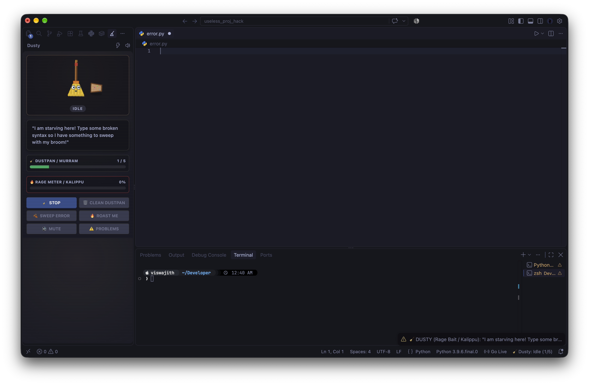
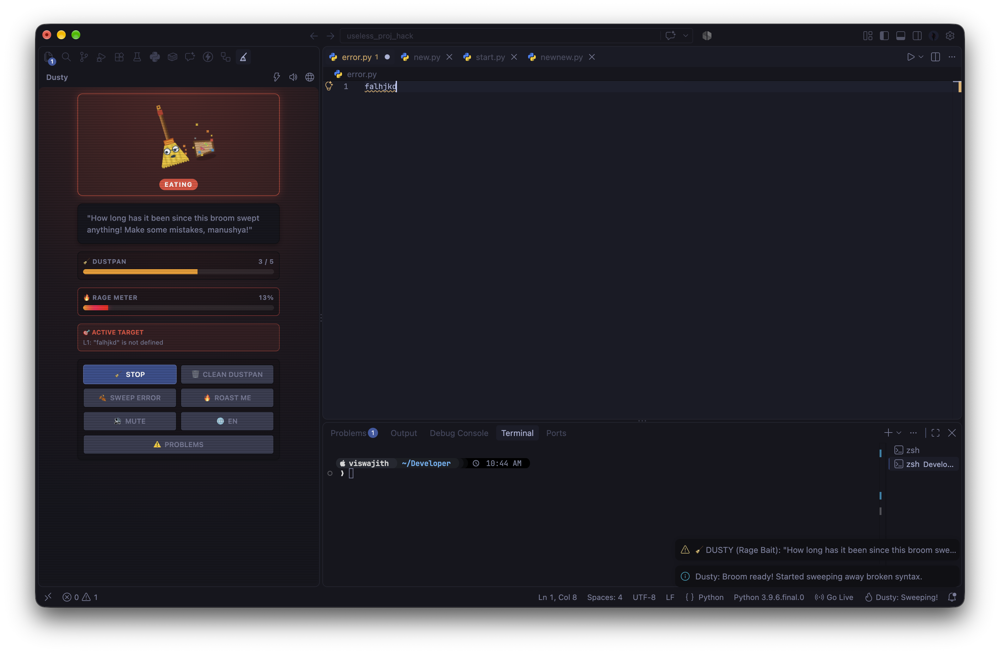
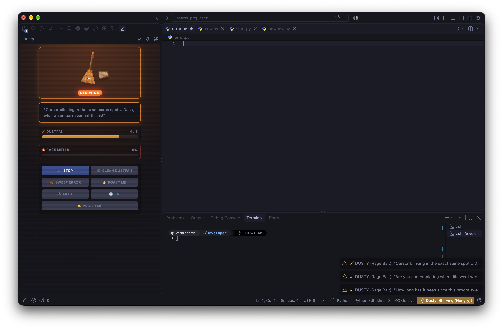
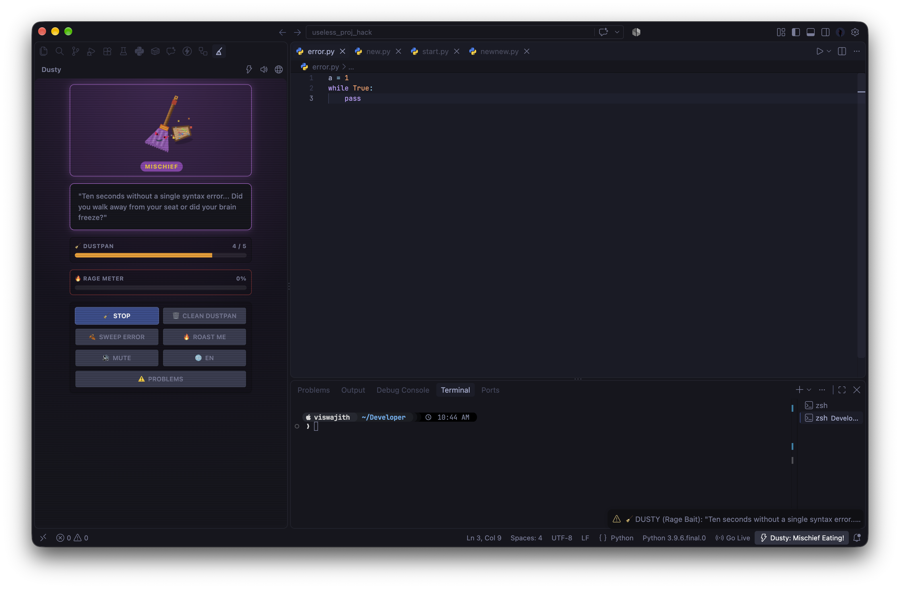
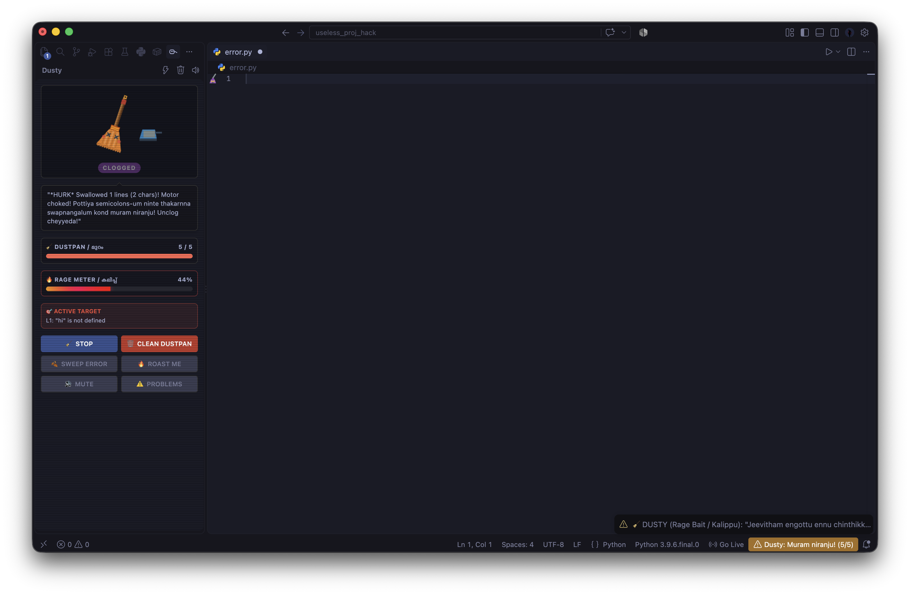
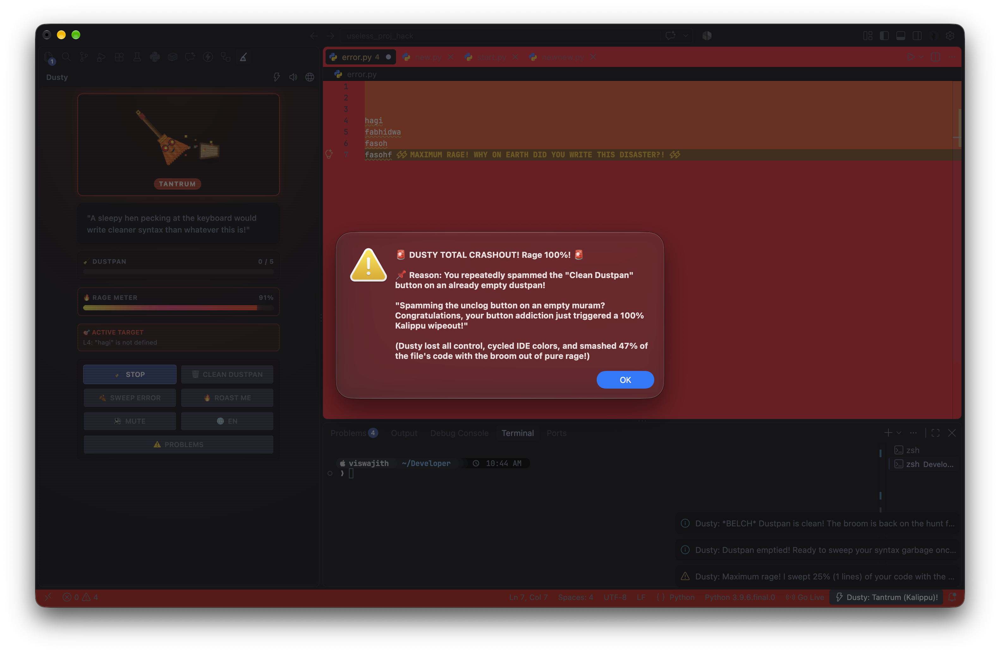
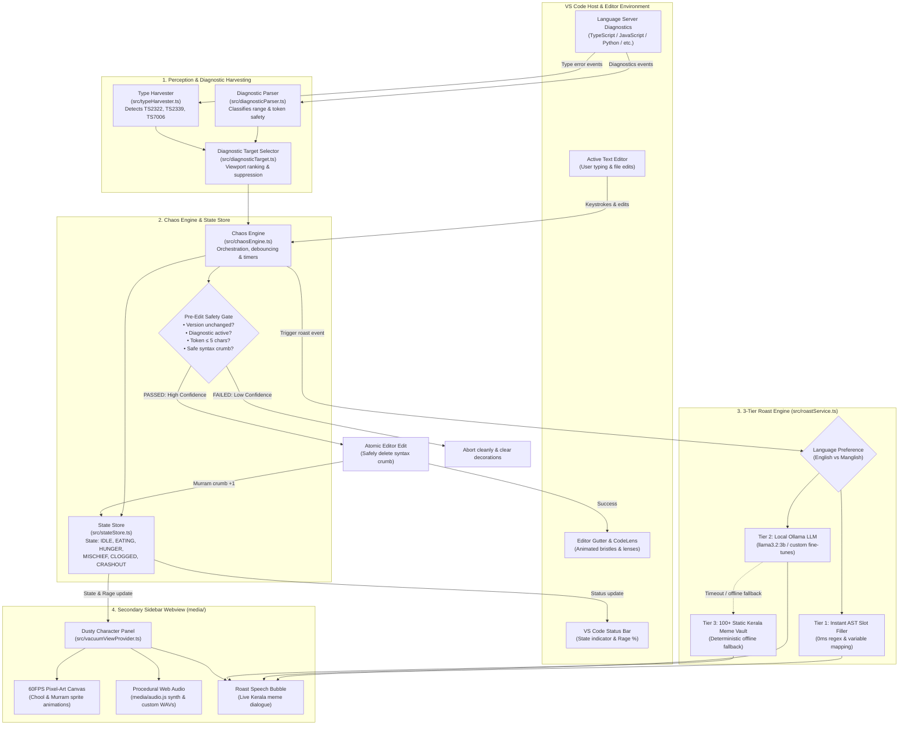

# Dusty the Chool

## Basic Details
### Team Name: **VAZHAS**

### Team Members
- Team Lead: Viswajith M P - GECT
- Member 2: Ishaangoutham K S - GECT

### Project Description
Dusty the Chool is an interactive, bad-tempered pairing companion modeled after a traditional Kerala coconut broom (chool) living directly inside VS Code. Rather than assisting you, Dusty watches your editor diagnostics with judging eyes, sweeps your syntax errors into his dustpan (Murram), throws full-blown tantrums, deletes broken code when his Rage Meter fills up, and personally roasts your life choices with famous Kerala memes in English.

### The Problem (that doesn't exist)
Modern developers are suffering from a dangerous epidemic of "peace of mind" and "excessive productivity." AI tools like Copilot and ChatGPT are overly polite, apologizing for minor hallucinations and quietly fixing syntax errors. This has deprived programmers of the traditional, character-building trauma of being scolded by an angry elder with a household broom. Furthermore, stray semicolons, dangling brackets, and broken functions are sitting around in codebases without an irritable virtual broom actively sweeping them into a virtual dustpan and screaming at you.

### The Solution (that nobody asked for)
We built Dusty: a native VS Code pairing broom with severe anger management issues.

When you write buggy code, Dusty doesn't offer gentle auto-complete. He marches multi-frame pixelated bristles down your editor gutter, vacuums the offending token or broken function into his dustpan, and delivers brutal Kerala meme roasts in English (*"Aaraattu Annan review of your code: 'Utter disaster, total flop show, mind-blowing crashout, guys!' My parents were right about planting a banana tree (vazha) instead of hiring you!"*).

If you dare to type while he is sweeping, he aggressively deletes what you just typed to teach you keyboard discipline. If his dustpan fills with 5 syntax crumbs, he chokes and halts your editor until you manually unclog him. And if his Rage Meter hits 100%, he enters full "Crashout Mode", strobes your editor with an emergency apocalypse theme, and deletes random chunks of code out of pure vengeance while screaming with Kerala meme roasts.

### Key Chaotic Features
- **Hunger & Mischief Engine**: Writing bug-free code for too long? Dusty gets bored and hungry! After a randomized 35–45s without any syntax errors, Dusty issues a menacing Kerala meme threat (*"I am starving! Give me food in 10 seconds or I will devour your favorite working function! Not a Threat, it's a promise!"*). Saving the file (`Cmd+S` / `Ctrl+S`) does not stop his hunger—Dusty mocks your save attempts! If ignored for another 11–21s, Dusty commits petty sabotage, eating a working functional code line with a mischievous cackle!
- **State-Reactive Side Panel Ambiance**: The side panel background, borders, and glows dynamically morph to match Dusty's emotional state—from gentle Kerala bamboo coir warmth (`IDLE`), to alert amber (`HUNTING`), fiery crimson (`EATING`), menacing dark pumpkin (`HUNGER`), villainous ultraviolet (`MISCHIEF`), choking dust purple (`CLOGGED`), and full neon red catastrophe (`CRASHOUT`).
- **100% Rage & Crashout Apocalypse**: Overwhelming Dusty with edits or spamming the "Clean Dustpan" button 3+ times on an empty muram triggers full Crashout Mode—strobing your editor with an emergency apocalypse theme, deleting code out of pure vengeance, and explicitly explaining the crashout reason in the roast dialog and notification!
- **Instant English / Manglish Language Switch**: Switch between English and Manglish with a single click or shortcut (`Cmd+Alt+D L`). The entire extension adapts dynamically—sidebar UI buttons, state badges, meter titles, CodeLens, status bar, local fallback roasts, and LLM prompt generation!
- **Animated Kerala Bamboo Dustpan (Murram)**: A traditional woven bamboo dustpan beside the broom with authentic reed texture, dynamic dust crumb accumulation, and animated forward-tilting to catch fallen syntax crumbs.
- **Local LLM Integration (⚠️ Hazardous Pairing Advisory)**: Connect a local Ollama instance for a personalized roasting experience that will make you rethink your life choices! We recommend `llama3.2:3b` as the recommended model (fast, punchy, savage), but any model is fine. Offline fallback is 100% self-contained.
- **LRU Dialogue De-Duplication**: Integrated history ring buffer ensures roasts, rage baits, and threats never repeat consecutively.
- **3-Tier Type Error Harvester**: Hooks into diagnostics to extract type mismatches (TS2322/TS2345), missing properties (TS2339), implicit any (TS7006), argument count mismatches, and cascading line clusters. Roasts them dynamically across three tiers: 0ms instant AST/regex slot-fillers, an async Ollama bridge, and a 100+ static fallback bank.
- **Viral Kerala Meme Bank**: 100+ curated savage trolls referencing *Aaraattu Annan, Vazha, KSRTC Swift, KSEB power cuts, Moral policing uncles, Food vloggers, WhatsApp family groups, PSC coaching*, and *Santhosh Pandit*.

## Technical Details
### Technologies/Components Used
For Software:
- Languages used: TypeScript, JavaScript, Web Audio API, HTML5 Canvas, Theme-native CSS
- Frameworks used: VS Code Extensibility API (`vscode` 1.85.0+), VS Code Webview API, Language Server Diagnostics
- Libraries used: Zero external runtime npm dependencies (compiled with raw `tsc`, procedural Web Audio synthesizer, procedural SVG frame generator, native Node.js `fs` & `zlib`)
- Tools used: VS Code Extension Development Host, Ollama (Local 3B LLM inference using `llama3.2:3b`), vsce (VS Code Extension Packager), npm, Git, Mocha (test runner)

For Hardware:
- Main components: Coconut palm frond / Eerkili (virtually simulated in 60fps canvas), Mechanical keyboard (the primary victim), Monitor (subjected to emergency strobe themes)
- Specifications: Infinite annoyance capability, 0% productivity throughput, 100% rage saturation point
- Tools required: VS Code, a keyboard you don't mind getting yelled at for touching, an active Ollama instance for AI-generated trauma

### Implementation
For Software:
# Installation
```bash
# Clone the repository
git clone https://github.com/viswajith275/useless_project_temp.git
cd useless_project_temp/Dusty_The_Chool

# Install dependencies
npm install

# Compile TypeScript
npm run compile

# Package as a VS Code VSIX extension
npm run package

# or you can install .vsix file from releases and run it
```

# Run
```bash
# Install the generated VSIX directly into VS Code:
code --install-extension dusty-the-chool-0.1.0.vsix

# Or press F5 inside VS Code to launch the Extension Development Host window.

# Optional: Run local Ollama 3B model for personalized Kerala meme roasts in English:
ollama run llama3.2:3b
```

### Project Documentation
For Software:

# Screenshots & Emotional States Lifecycle

Dusty shifts dynamically through six distinct emotional states based on diagnostics, dustpan capacity, hunger intervals, and rage accumulation:

### 1. Idle State (Monitoring & Judging)

*Dusty the Chool resting calmly in the secondary sidebar with live state badge, speech bubble, dustpan capacity (murram), and rage meter.*

### 2. Ingesting & Eating State (Syntax Error Sweeper)

*Multi-frame pixel-art broom bristles marching down the editor gutter toward a syntax error to sweep stray crumbs into the bamboo murram.*

### 3. Hunger & Starving State (Clean Code Penalty)

*Writing error-free code for 35s–45s starves Dusty! He demands broken syntax crumbs, and saving files (`Cmd+S`) does not cancel his hunger timer.*

### 4. Mischief State (Petty Sabotage Deletion)

*If hunger goes unfed for another 11s–21s, Dusty commits petty sabotage by devouring a working functional code line.*

### 5. Clogged State (Murram Capacity Full)

*At 5/5 crumbs, the bamboo dustpan overflows and Dusty chokes, pausing auto-ingestion until manually emptied via `Cmd+Alt+U C` or the Clean Dustpan button.*

### 6. Crashout Apocalypse State (100% Rage & Anti-Spam Trigger)

*Triggered at 100% Rage or after spamming "Clean Dustpan" 3 times on an empty muram—unleashing sirens, red screen strobe, and code purging with explicit crashout reasons.*

# Workflow & Architectural Diagram

Dusty operates as a decoupled, multi-tier system inside VS Code that continuously samples compiler diagnostics, orchestrates safe atomic editor modifications, syncs runtime state with an animated sidebar webview, and triggers localized Kerala meme roasts via a 3-tier intelligence pipeline:



### Architectural Subsystems

1. **Perception & Diagnostic Harvesting (`src/diagnosticParser.ts`, `src/typeHarvester.ts`, `src/diagnosticTarget.ts`)**:
   - Continuously listens to `vscode.languages.onDidChangeDiagnostics`.
   - Distinguishes between safely disposable syntax artifacts (stray semicolons `;;`, unclosed braces) and semantic/type errors.
   - Restricts auto-ingestion strictly to tokens &le; 5 characters.
   - Extracts type mismatches (`TS2322`/`TS2345`), missing properties (`TS2339`), and implicit any (`TS7006`) for contextual roasting.

2. **Chaos Engine & Safety Gate (`src/chaosEngine.ts`, `src/stateStore.ts`)**:
   - Debounces typing events (default 2500ms) to allow developer typing before judging.
   - Enforces the **Non-Negotiable Safety Gate**: re-checks that `document.version` has not changed, diagnostic is still active in the language server, and the file is writable immediately prior to `editor.edit()`.
   - Manages the **Hunger & Mischief timers**: if no syntax errors are seen for 35–45s, triggers a hunger warning. Saving the file (`Cmd+S`) does not deactivate hunger—Dusty taunts the save attempt and proceeds to mischief line deletion if ignored for another 11–21s.
   - Synchronizes state across VS Code context keys (`dusty.state`, `dusty.clogged`, `dusty.rage`).

3. **3-Tier Roast Engine (`src/roastService.ts`)**:
   - **Tier 1 (Instant Slot-Filler)**: 0ms AST/regex template replacer injecting actual variable names and type identifiers into custom meme templates.
   - **Tier 2 (Local LLM Bridge)**: Communicates with local Ollama (`llama3.2:3b` recommended) over HTTP with strict system prompt conditioning and selected language authority (English vs Manglish).
   - **Tier 3 (Static Kerala Meme Vault)**: 100+ curated viral roasts with LRU ring-buffer history de-duplication to prevent repetitive jokes.

4. **Secondary Sidebar Webview & Audio Pipeline (`src/vacuumViewProvider.ts`, `media/`)**:
   - Hosts a responsive pixel-art canvas rendering Dusty's coconut bristles, animated Murram dustpan, CRT scanline overlay, and live speech bubble.
   - Powered by a zero-asset Web Audio synthesizer (`media/audio.js`) generating procedural 8-bit sounds alongside preloaded authentic Kerala meme audio clips.

### Project Demo
# Video
[Watch Dusty in Action (Demo Video)](https://github.com/viswajith275/useless_project_temp/releases/download/v0.1.0/dusty_demo.mov)

*Demonstration video showing Dusty detecting syntax typos, sweeping code into his dustpan, choking on errors, and unleashing full 100% rage crashout mode with custom Kerala meme roasts.*

# Live Web Companion & Interactive Simulator
- **Live Demo:** [dusty-hazel.vercel.app](https://dusty-hazel.vercel.app)

- VSIX Extension Package: `dusty-the-chool-0.1.0.vsix`
- Command Palette Integration: Run `Cmd+Shift+P` -> `Dusty: Roast Me` or `Dusty: Trigger Crashout`

## Team Contributions
- Viswajith M P: Architectural design, VS Code extension host integration, diagnostic classification, procedural Web Audio synthesizer, Ollama 3B local LLM prompt engineering, and Kerala meme roast writing.
- Ishaangoutham K S: Canvas pixel-art renderer, CRT filter overlay, theme-switching chaos engine, and sound effect curation.

---
Made with ❤️ at TinkerHub Useless Projects 


