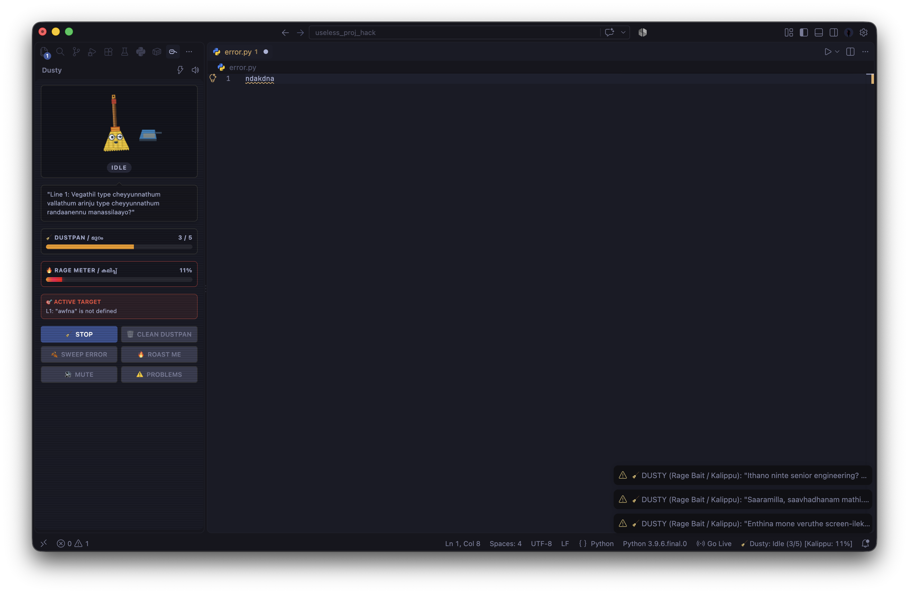

# Dusty the Malicious Chool

## Basic Details
### Team Name: **VAZHAS**

### Team Members
- Team Lead: Viswajith M P - GECT
- Member 2: Ishaangoutham K S - GECT

### Project Description
Dusty the Malicious Chool is an interactive, bad-tempered pairing companion modeled after a traditional Kerala coconut broom (chool / ചൂൽ) living directly inside VS Code. Rather than assisting you, Dusty watches your editor diagnostics with judging eyes, sweeps your syntax errors into his dustpan (മുറം), throws full-blown tantrums, deletes broken code when his Rage Meter fills up, and personally roasts your life choices in savage Manglish with iconic Malayalam cinema references.

### The Problem (that doesn't exist)
Modern developers are suffering from a dangerous epidemic of "peace of mind" and "excessive productivity." AI tools like Copilot and ChatGPT are overly polite, apologizing for minor hallucinations and quietly fixing syntax errors. This has deprived programmers of the traditional, character-building trauma of being scolded by an angry elder with a household broom. Furthermore, stray semicolons, dangling brackets, and broken functions are sitting around in codebases without an irritable virtual broom actively sweeping them into a virtual dustpan and screaming at you.

### The Solution (that nobody asked for)
We built Dusty: a native VS Code pairing broom with severe anger management issues.

When you write buggy code, Dusty doesn't offer gentle auto-complete. He marches multi-frame pixelated bristles down your editor gutter, vacuums the offending token or broken function into his dustpan, and delivers brutal roasts in Manglish (*"Sandesham Shankaradi chodicha pole chodikuva: Thanikku vere paniyille hey? Poyi valla thattukadayum thudanguda!"*).

If you dare to type while he is sweeping, he aggressively deletes what you just typed to teach you keyboard discipline. If his dustpan fills with 5 syntax crumbs, he chokes and halts your editor until you manually unclog him. And if his Rage Meter hits 100%, he enters full "Rangannan Crashout Mode", strobes your editor with an emergency apocalypse theme, and deletes random chunks of code out of pure vengeance while screaming in Manglish.

## Technical Details
### Technologies/Components Used
For Software:
- Languages used: TypeScript, JavaScript, Web Audio API, HTML5 Canvas, Theme-native CSS
- Frameworks used: VS Code Extensibility API (`vscode` 1.85.0+), VS Code Webview API, Language Server Diagnostics
- Libraries used: Zero external runtime npm dependencies (compiled with raw `tsc`, procedural Web Audio synthesizer, procedural SVG frame generator, native Node.js `fs` & `zlib`)
- Tools used: VS Code Extension Development Host, Ollama (Local 3B LLM inference using `llama3.2:3b`), vsce (VS Code Extension Packager), npm, Git, Mocha (test runner)

For Hardware:
- Main components: Coconut palm frond / Eerkili (virtually simulated in 60fps canvas), Mechanical keyboard (the primary victim), Monitor (subjected to emergency strobe themes)
- Specifications: Infinite annoyance capability, 0% productivity throughput, 100% rage saturation point
- Tools required: VS Code, a keyboard you don't mind getting yelled at for touching, an active Ollama instance for AI-generated trauma

### Implementation
For Software:
# Installation
```bash
# Clone the repository
git clone https://github.com/viswajith275/useless_project_temp.git
cd useless_project_temp

# Install dependencies
npm install

# Compile TypeScript
npm run compile

# Package as a VS Code VSIX extension
npm run package
```

# Run
```bash
# Install the generated VSIX directly into VS Code:
code --install-extension dusty-vacuum-0.1.0.vsix

# Or press F5 inside VS Code to launch the Extension Development Host window.

# Optional: Run local Ollama 3B model for personalized Manglish roasts:
ollama run llama3.2:3b
```

### Project Documentation
For Software:

# Screenshots

*Dusty the Chool resting in the secondary sidebar with live state badge, speech bubble, dustpan capacity (മുറം), and rage meter.*


*Multi-frame pixel-art broom bristles marching down the editor gutter toward a syntax error with native 'Feed Dusty' CodeLens.*


*Dusty reaching 100% Rage, triggering emergency strobes and entering full Rangannan revenge code-deletion mode.*

### Project Demo
# Video
[Add your demo video link here]
*Demonstration video showing Dusty detecting syntax typos, sweeping code into his dustpan, choking on errors, and unleashing full 100% rage crashout mode with custom Manglish roasts.*

# Additional Demos
[Add any extra demo materials/links]
- VSIX Extension Package: `dusty-vacuum-0.1.0.vsix`
- Command Palette Integration: Run `Cmd+Shift+P` -> `Dusty: Roast Me` or `Dusty: Trigger Crashout`

## Team Contributions
- Viswajith M P: Architectural design, VS Code extension host integration, diagnostic classification, procedural Web Audio synthesizer, Ollama 3B local LLM prompt engineering, and Manglish roast writing.
- Ishaangoutham K S: Canvas pixel-art renderer, CRT filter overlay, theme-switching chaos engine, and sound effect curation.

---
Made with ❤️ at TinkerHub Useless Projects 


